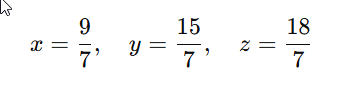

# Układ dwóch równań liniowych

## 1. Model kosztów

**Sytuacja:** firma kurierska nalicza opłatę: 5 zł opłata startowa + 2 zł za każdy km.

**Model matematyczny:**


y = 2x + 5


* x – liczba kilometrów
* y – koszt przesyłki

**Interpretacja:**

* a = 2 → każda dodatkowa jednostka odległości zwiększa koszt o 2 zł
* b = 5 → opłata startowa

**Wersja w Pythonie:**

```python
def koszt_przesylki(km, a=2, b=5):
    return a*km + b

print(koszt_przesylki(10))  # 25 zł
```

---

## 2. Model zużycia energii

**Sytuacja:** urządzenie elektryczne zużywa energię stałą plus proporcjonalną do czasu pracy.


E = P*t + E_<sup>stałe</sup>


* E – energia [kWh]
* t – czas pracy [h]
* P – moc urządzenia
* E_<sup>stałe</sup> – strata energii w trybie czuwania

**Interpretacja:** model liniowy pomaga przewidzieć rachunki za energię dla różnych scenariuszy.

---

## 3. Model sprzedaży w sklepie

Sklep sprzedaje produkt po 10 zł za sztukę, niezależnie od ilości. Jeśli jednak klient kupuje powyżej 20 sztuk, daje rabat 5 zł.

* Model liniowy prosto do 20 sztuk:
  [
  y = 10 \cdot x
  ]
* Można zrobić układ równań dla dwóch scenariuszy:
  [
  \begin{cases}
  y = 10x & x \le 20 \
  y = 10x - 5 & x > 20
  \end{cases}
  ]

**Interpretacja:** wprowadza **progi decyzyjne** w modelu i pokazuje, że prosta może mieć „łamane” zależności.

---

## 4. Model predykcji czasu realizacji zadania

Jeżeli projekt wymaga 3 godzin na element bazowy, a dodatkowe zadania dodają czas liniowo:

[
T = 3 \cdot n + 2
]

* (n) – liczba zadań
* (2) – czas przygotowania dokumentów
* (T) – całkowity czas pracy

**Python:**

```python
def czas_projektu(n):
    return 3*n + 2

print(czas_projektu(5))  # 17 godzin
```

---

## 5. Model układu równań – mieszanki lub zasoby

**Sytuacja:** produkcja napoju wymaga mieszanki dwóch składników A i B:

[
\begin{cases}
2x + y = 100 \quad &\text{(wymagana ilość A)}\
x + 3y = 90 \quad &\text{(wymagana ilość B)}
\end{cases}
]

* Rozwiązanie układu: ile jednostek A i B potrzeba, żeby zaspokoić wymagania.
* Tu równania liniowe stają się **modelem decyzyjnym** dla planowania produkcji.

**Python:**

```python
def solve_system(a1,b1,c1,a2,b2,c2):
    D = a1*b2 - a2*b1
    if D == 0:
        return None
    Dx = c1*b2 - c2*b1
    Dy = a1*c2 - a2*c1
    return Dx/D, Dy/D

x, y = solve_system(2,1,100,1,3,90)
print(x, y)  # ilości A i B
```

---

💡 **Wskazówka dla uczniów:**

* Zawsze zacznij od **opisania sytuacji słownej**.
* Wypisz zmienne i ich znaczenie.
* Napisz równanie lub układ.
* Zastosuj Python lub wykres, aby zobaczyć zależność w praktyce.
* To jest właśnie **przekładanie problemu realnego na model matematyczny**.


# 🚚 Model logistyczny: dystrybucja towarów (3 trasy, 3 ograniczenia)
## 1️⃣ Opis sytuacji (język naturalny)

Firma logistyczna musi dostarczyć towary **z jednego magazynu** do **trzech miast**:

* Miasto **A**
* Miasto **B**
* Miasto **C**

Do dyspozycji są **3 ograniczenia logistyczne**:

* dostępny **czas kierowców**,
* dostępne **paliwo**,
* **ładowność floty**.

---

## 2️⃣ Zmienne decyzyjne (co planujemy)

* (x) – liczba kursów do miasta **A**
* (y) – liczba kursów do miasta **B**
* (z) – liczba kursów do miasta **C**

*(kurs = jednostkowy transport)*

---

## 3️⃣ Dane logistyczne (tabele — bardzo dydaktyczne)

### Zużycie zasobów przez jeden kurs

| Trasa | Czas (h) | Paliwo (l) | Ładowność (t) |
| ----- | -------- | ---------- | ------------- |
| A     | 1        | 1          | 1             |
| B     | 2        | −1         | 1             |
| C     | 1        | 2          | −1            |

> Uwaga dydaktyczna: ujemne wartości oznaczają **odzysk / brak zużycia** (np. powrót z ładunkiem zwrotnym).

---

### Dostępne zasoby w danym dniu

| Zasób     | Ilość |
| --------- | ----- |
| Czas      | 6     |
| Paliwo    | 3     |
| Ładowność | 3     |

---

## 4️⃣ Budowa modelu matematycznego

Zapisujemy ograniczenia:


➡️ **Ten sam układ równań**, ale **zupełnie inna interpretacja**.

---

## 5️⃣ Rozwiązanie układu



---

## 6️⃣ Interpretacja logistyczna wyniku

| Zmienna          | Znaczenie                       |
| ---------------- | ------------------------------- |
| (x &#8776; 1.29) | intensywność kursów do miasta A |
| (y &#8776; 2.14) | intensywność kursów do miasta B |
| (z &#8776; 2.57) | intensywność kursów do miasta C |

➡️ Model **ciągły**:

* nadaje się do planowania **czasu, obciążenia floty, paliwa**,
* w rzeczywistości zaokrąglenia wymagają optymalizacji.

---

## 7️⃣ Python — rozwiązanie logistyczne (NumPy)

```python
import numpy as np

# macierz zużycia zasobów logistycznych
A = np.array([
    [1, 1, 1],   # czas
    [2, -1, 1],  # paliwo
    [1, 2, -1]   # ładowność
])

# dostępne zasoby
b = np.array([6, 3, 3])

x, y, z = np.linalg.solve(A, b)

print(f"Kursy A: {x:.3f}")
print(f"Kursy B: {y:.3f}")
print(f"Kursy C: {z:.3f}")
```

---

## 8️⃣ Co ten model **uczy ucznia**?

| Kompetencja | Co uczeń rozumie                      |
| ----------- | ------------------------------------- |
| Modelowanie | Jak przełożyć opis słowny na równania |
| Logistyka   | Planowanie tras i zasobów             |
| Informatyka | NumPy jako narzędzie decyzyjne        |
| Matematyka  | Sens równań liniowych                 |
| Analiza     | Co się stanie po zmianie zasobów      |

---

## 9️⃣ Naturalne rozszerzenia (kolejne lekcje)

### 🔹 1. Co jeśli wzrośnie paliwo?

```python
b = np.array([6, 4, 3])
print(np.linalg.solve(A, b))
```

### 🔹 2. Minimalizacja kosztów paliwa

→ **programowanie liniowe**

### 🔹 3. Kursy tylko całkowite

→ **programowanie całkowitoliczbowe**

---

## 🔁 Zadanie dla uczniów

**Zadanie:**
Zmodyfikuj model:

* dodaj miasto **D**,
* dodaj nowe ograniczenie (np. liczba kierowców),
* zapisz układ równań i spróbuj go rozwiązać w Pythonie.

---

## 🧠 Podsumowanie dydaktyczne

> **Równania liniowe to język planowania.**
> Ekonomia → Logistyka → Informatyka
> To nie są „zadania z matematyki”, tylko **modele decyzyjne świata rzeczywistego**.

---

