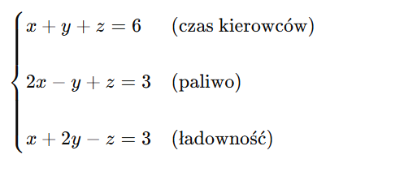

# 🚚 Model logistyczny: dystrybucja towarów (3 trasy, 3 ograniczenia)

## 1️⃣ Opis sytuacji (język naturalny)

Firma logistyczna musi dostarczyć towary **z jednego magazynu** do **trzech miast**:

* Miasto **A**
* Miasto **B**
* Miasto **C**

Do dyspozycji są **3 ograniczenia logistyczne**:

* dostępny **czas kierowców**,
* dostępne **paliwo**,
* **ładowność floty**.

---

## 2️⃣ Zmienne decyzyjne (co planujemy)

* (x) – liczba kursów do miasta **A**
* (y) – liczba kursów do miasta **B**
* (z) – liczba kursów do miasta **C**

*(kurs = jednostkowy transport)*

---

## 3️⃣ Dane logistyczne (tabele — bardzo dydaktyczne)

### Zużycie zasobów przez jeden kurs

| Trasa | Czas (h) | Paliwo (l) | Ładowność (t) |
| ----- | -------- | ---------- | ------------- |
| A     | 1        | 1          | 1             |
| B     | 2        | −1         | 1             |
| C     | 1        | 2          | −1            |

> Uwaga dydaktyczna: ujemne wartości oznaczają **odzysk / brak zużycia** (np. powrót z ładunkiem zwrotnym).

---

### Dostępne zasoby w danym dniu

| Zasób     | Ilość |
| --------- | ----- |
| Czas      | 6     |
| Paliwo    | 3     |
| Ładowność | 3     |

---

## 4️⃣ Budowa modelu matematycznego

Zapisujemy ograniczenia:



➡️ **Ten sam układ równań**, ale **zupełnie inna interpretacja**.

---

## 5️⃣ Rozwiązanie układu

[
x = \frac{9}{7}, \quad
y = \frac{15}{7}, \quad
z = \frac{18}{7}
]

---

## 6️⃣ Interpretacja logistyczna wyniku

| Zmienna          | Znaczenie                       |
| ---------------- | ------------------------------- |
| (x \approx 1.29) | intensywność kursów do miasta A |
| (y \approx 2.14) | intensywność kursów do miasta B |
| (z \approx 2.57) | intensywność kursów do miasta C |

➡️ Model **ciągły**:

* nadaje się do planowania **czasu, obciążenia floty, paliwa**,
* w rzeczywistości zaokrąglenia wymagają optymalizacji.

---

## 7️⃣ Python — rozwiązanie logistyczne (NumPy)

```python
import numpy as np

# macierz zużycia zasobów logistycznych
A = np.array([
    [1, 1, 1],   # czas
    [2, -1, 1],  # paliwo
    [1, 2, -1]   # ładowność
])

# dostępne zasoby
b = np.array([6, 3, 3])

x, y, z = np.linalg.solve(A, b)

print(f"Kursy A: {x:.3f}")
print(f"Kursy B: {y:.3f}")
print(f"Kursy C: {z:.3f}")
```

---

## 8️⃣ Co ten model **uczy ucznia**?

| Kompetencja | Co uczeń rozumie                      |
| ----------- | ------------------------------------- |
| Modelowanie | Jak przełożyć opis słowny na równania |
| Logistyka   | Planowanie tras i zasobów             |
| Informatyka | NumPy jako narzędzie decyzyjne        |
| Matematyka  | Sens równań liniowych                 |
| Analiza     | Co się stanie po zmianie zasobów      |

---

## 9️⃣ Naturalne rozszerzenia (kolejne lekcje)

### 🔹 1. Co jeśli wzrośnie paliwo?

```python
b = np.array([6, 4, 3])
print(np.linalg.solve(A, b))
```

### 🔹 2. Minimalizacja kosztów paliwa

→ **programowanie liniowe**

### 🔹 3. Kursy tylko całkowite

→ **programowanie całkowitoliczbowe**

---

## 🔁 Zadanie dla uczniów

**Zadanie:**
Zmodyfikuj model:

* dodaj miasto **D**,
* dodaj nowe ograniczenie (np. liczba kierowców),
* zapisz układ równań i spróbuj go rozwiązać w Pythonie.

---

## 🧠 Podsumowanie dydaktyczne

> **Równania liniowe to język planowania.**
> Ekonomia → Logistyka → Informatyka
> To nie są „zadania z matematyki”, tylko **modele decyzyjne świata rzeczywistego**.

---

