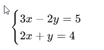
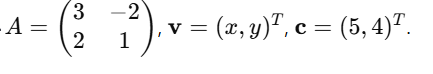
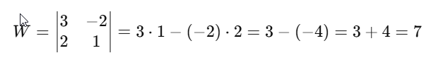
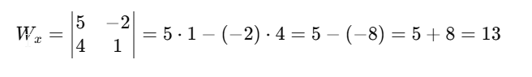
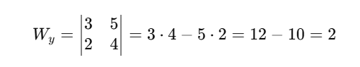
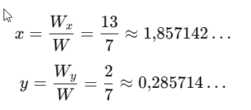
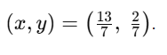

# Przykłady krok po kroku — układy równań

---

## Przykład 1 — metoda podstawiania

**Układ**
    y = 2x + 1
    3x + y = 10


### Krok 1 — podstawiamy wyrażenie na (y) z pierwszego równania do drugiego

Drugi: 3x + y = 10. Z pierwszego mamy y = 2x + 1.
Podstawiamy:
    3x + (2x + 1) = 10

### Krok 2 — redukcja wyrażeń (rozpisane cyfrowo)

1. Dodajamy 3x i 2x: 3x + 2x = 5x.
   Otrzymujemy: 5x + 1 = 10.
2. Odejmujemy 1 od obu stron: 5x = 10 - 1 = 9.
3. Dzielimy przez 5: (x = 9/5 = 1,8).

### Krok 3 — obliczamy (y)

Z y = 2x + 1: podstawiamy (x = 1,8):
    y = 2 * 1,8 + 1 = 3,6 + 1 = 4,6


### Wynik

    (x, y) = (1,8, 4,6)


### Interpretacja geometryczna

Proste y = 2x+1 i 3x+y=10 (czyli y = -3x + 10) przecinają się w punkcie (1,8;4,6).

### Kod Python (bez bibliotek)

```python
def solve_substitution():
    # y = 2x + 1
    # 3x + y = 10 -> 3x + (2x+1) = 10
    x = 9/5       # 1.8
    y = 2*x + 1   # 4.6
    print(x, y)

solve_substitution()
```

---

## Przykład 2 — metoda przeciwnych współczynników (eliminacja)

**Układ**

    2x + 3y = 7 
    4x - 3y = 1


Celem jest wyeliminować (y) dodając równania (współczynniki +3y i -3y znoszą się).

### Krok 1 — dodajemy równania stronami


    (2x + 3y) + (4x - 3y) = 7 + 1

Lewo: 2x + 4x + 3y - 3y = 6x + 0 = 6x. Prawo: 7 + 1 = 8.

Mamy: 6x = 8.

### Krok 2 — obliczamy (x)

    x = 8/6 = 4/3 = 1,333...(możesz zapisać 1,333)


Trzymamy ułamek x = 4/3 dla dokładności.

### Krok 3 — obliczamy (y)

Podstawiamy do pierwszego równania 2x + 3y = 7:

    2 * 4/3 + 3y = 7

Obliczamy 2 * 4/3 = 8/3.

Mamy:

    8/3 + 3y = 7

Przekształcamy: 3y = 7 - 8/3 = 21/3 - 8/3 = 13/3.

Dzielimy przez 3:

    y = 13/3 * 1/3 = 13/9 &#8776; 1,444


### Wynik

    (x,y) = (4/3, 13/9)
lub w przybliżeniu 1,333, 1,444.

### Kod Python (bez numpy)

```python
def solve_elimination():
    # 2x + 3y = 7
    # 4x - 3y = 1
    # dodajemy -> 6x = 8
    x = 8/6            # 4/3
    # obliczamy y: 2x + 3y = 7 -> 3y = 7 - 2x
    y = (7 - 2*x) / 3
    print(x, y)

solve_elimination()
```

---

## Przykład 3 — metoda wyznaczników (Cramer) — krok po kroku

**Układ**



Zapis macierzowy: Av = c, gdzie



### Krok 1 — wyznacznik macierzy (A)



Wyznacznik (W = 7) (nie jest 0 → układ ma jednoznaczne rozwiązanie).

### Krok 2 — wyznacznik (W_x) (zamieniamy kolumnę x wektorem prawej strony)



### Krok 3 — wyznacznik (W_y) (zamieniamy kolumnę y)



### Krok 4 — rozwiązania



W ułamkach: 

### Kod Python (Cramer i numpy)

Bez numpy (prosty kod):

```python
def solve_cramer(a1,b1,c1,a2,b2,c2):
    W = a1*b2 - a2*b1
    if W == 0:
        return None
    Wx = c1*b2 - c2*b1
    Wy = a1*c2 - a2*c1
    x = Wx / W
    y = Wy / W
    return x, y

print(solve_cramer(3, -2, 5, 2, 1, 4))
```

Z `numpy`:

```python
import numpy as np

A = np.array([[3, -2],[2, 1]])
b = np.array([5, 4])
x, y = np.linalg.solve(A, b)
print(x, y)   # ~1.857142857, 0.2857142857
```

---

## Krótkie wskazówki dydaktyczne dla nauczyciela

* Zawsze zaczynaj od sprawdzenia, czy współczynniki sugerują eliminację bez mnożenia (np. +3y i −3y).
* Dla dokładności pokazuj ułamki — zapisywanie w postaci ułamków (np. (\tfrac{4}{3})) jest lepsze niż jedynie przybliżenie dziesiętne.
* Graficzna interpretacja (rysunek prostych) pomaga oszacować wynik i wychwycić błędy.

---

## Krótkie zadania do ćwiczeń (zadania domowe)

1. Rozwiąż układ metodą podstawiania:
   [
   \begin{cases}
   y = -x + 3 \
   2x + y = 8
   \end{cases}
   ]
2. Rozwiąż układ metodą eliminacji:
   [
   \begin{cases}
   5x + 2y = 12 \
   3x - 4y = -2
   \end{cases}
   ]
3. Użyj Cramera, aby rozwiązać:
   [
   \begin{cases}
   4x - y = 9 \
   x + 2y = 1
   \end{cases}
   ]
   (Przy każdej odpowiedzi rozpisz wszystkie kroki.)

---

Jeśli chcesz, przygotuję teraz **kartę pracy z rozwiązaniami krok po kroku** (do wydruku) albo **interaktywne zadania HTML/JS** (uczeń wpisuje odpowiedź, strona sprawdza i pokazuje obliczenia). Co wybieramy?
